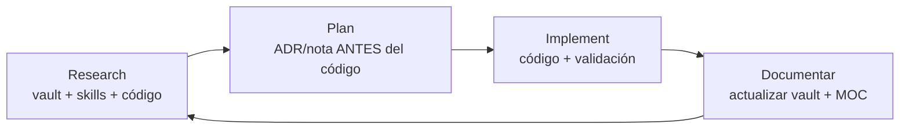

# RPI: Research → Plan → Implement

## Contexto

Ciclo de trabajo obligatorio para cada fase y cada feature de SisyFlow
([[ADR-006 Workflow IA con RPI]]). Su objetivo es evitar implementar sin
contexto o sin decisión documentada: primero se investiga, luego se decide por
escrito, y solo entonces se codifica.

> Prohibido saltarse Research o Plan. Si una tarea es trivial, el Plan puede ser
> una línea en la nota existente, pero existe.

## Contenido

### 1. Research

- Leer la nota del vault relacionada (índice: [[00 Inbox/MOC]]).
- Leer la US correspondiente en [[US's for personal development project]].
- Cargar las skills del dominio (herramienta `skill`): `supabase`,
  `supabase-postgres-best-practices`, `vercel-react-best-practices`, `electron-dev`,
  `frontend-design`, `sisyflow-db`, `obsidian` según el caso.
- Revisar el código existente antes de proponer cambios.
- Explorar opciones cuando haya decisiones abiertas (librerías, enfoques).

### 2. Plan

- Decidir el alcance exacto del cambio.
- Documentar la decisión **antes de codificar**:
  - Decisión significativa → **ADR** en `docs/10 Diseno/` (comando `/adr`).
  - Detalle técnico → nota en `docs/20 Tecnico/` (comando `/nota`).
- Verificar el guardrail de paridad si la tarea toca todos o editor
  ([[Paridad funcional con TodoDex]]).
- Definir cómo se valida (comandos, checklist).

### 3. Implement

- Codificar siguiendo las convenciones de `AGENTS.md` (raíz y carpeta).
- Validar el Definition of Done: lint, typecheck, tests, migraciones, RLS.
- Actualizar el vault (nota + MOC) y el README si cambió el uso.
- Cerrar con reporte: archivos tocados, pruebas ejecutadas, decisiones.

## Relaciones

- **MOC:** [[00 Inbox/MOC]]
- **Relacionada con:** [[Workflow IA]], [[Fases del proyecto]]
- **ADR:** [[ADR-006 Workflow IA con RPI]]
